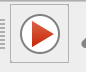
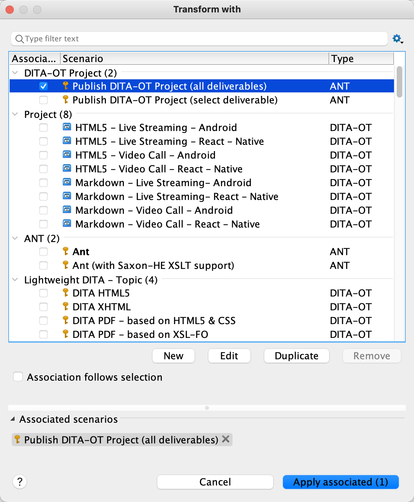

# DITA Guide Reuse Demo
This is a demo repository for writing guides in markdown and utilizing DITA for reuse.

## Prerequisites

- Install [oXygen XML Author](https://confluence.agoralab.co/display/TEKP/Oxygen+XML+Author+v23).
- Basic knowledge of DITA and [LwDITA](http://docs.oasis-open.org/dita/LwDITA/v1.0/cnprd01/LwDITA-v1.0-cnprd01.html).

## Project structure

All files are in the RTC folder. The following table lists the major files and folders:

| Folder/File                       | Description                                                  |
| --------------------------------- | ------------------------------------------------------------ |
| **config**                        | Configuration files, including all the filters, variables, and dita-ot project files. |
| `config/keys-android.ditamap`     | Definitions of variables that apply to the Android platform. |
| `config/keys-video.ditamap`       | Definitions of variables that apply to the Video Call product. |
| `config/output-video-android.xml` | An [DITA-OT project file](https://www.dita-ot.org/dev/topics/using-project-files.html) for generating Android Video Call docs. |
| **conref**                        | Files for content that can be conrefed.                      |
| `_Live-Streaming-Premium.ditamap` | The DITA map for the documentation of Live Streaming Premium. Use this map to organize topics and build outputs for Live Streaming Premium. |
| `_Video.ditamap`                  | The DITA map for the documentation of Video Call. Use this map to organize topics and build outputs for Video Call. |
| `get-started.md`                  | The parent topic for the Get Started guides. Contains the doc title and the introductory paragraph. |
| All the `start-*.md` files        | All the sub topics in the Get Started guides. Each file is named after the section title. If the topic only applies to a specific platform, the filename is suffixed with the platform, for example `start-project-setup-android.md`. |

## Content reuse strategies 

This demo project uses the following elements for reuse:

### Keyrefs

Imagine keys as variables, and keyrefs are references to the variables.

Use keyrefs for paragraphs or topics with only phrase-level differences, for example the platform name.

Keyrefs support the following types of content:

- Phrases. Example:

  ```markdown
  This page shows the minimum code you need to add [feature] into your app by using the [sdk-name] for [platform].
  ```

  The definition of the`feature` and `sdk-name` keys in `keys-video.ditamap`:

  ```xml
  <keydef keys="feature">
      <topicmeta>
          <keywords>
              <keyword>video call</keyword>
          </keywords>
      </topicmeta>
  </keydef>
  <keydef keys="sdk-name">
      <topicmeta>
          <keywords>
              <keyword>Agora Video SDK</keyword>
          </keywords>
      </topicmeta>
  </keydef>
  ```

  The definition of the `platform` key in `keys-android.ditamap`:

  ```xml
  <keydef keys="platform">
      <topicmeta>
          <keywords>
              <keyword>Android</keyword>
          </keywords>
      </topicmeta>
  </keydef>
  ```

- Links. Example:

  ```markdown
  Agora provides an open source sample project [start-sample-project-android] on GitHub that implements one-to-one video call and group video call for your reference.
  ```

  The definition of the `start-sample-project-android` key in `keys-video.ditamap`:

  ```xml
  <keydef keys="start-sample-project-android" href="https://github.com/AgoraIO/Basic-Video-Call" scope="external" format="html">
  ```

- Images. Example:

  ```markdown
  The following figure shows the workflow of a [feature] implemented by the Agora SDK.
  
  ![start-basic-workflow]
  ```

  The definition of the `start-basic-workflow` key  in `keys-video.ditamap`:

  ```xml
  <keydef keys="start-basic-workflow" href="https://web-cdn.agora.io/docs-files/1627550978702"format="png" scope="external"/>
  ```

### Conditions

Apply conditions for content applicable to a specific product or platform.

Conditions are set as an attribute, but the markdown syntax does not support attributes, you need to write XML tags for content to be marked and filtered.

> Only use the `props` attribute for conditons.

Example:

```xml
<ol>
<li props="live">Set the client role</li>
<li>Retrieve a token</li>
<li>Join a channel</li>
<li>Publish and subscribe to <ph keyref="media-type"/> in the channel</li>
</ol>
```

The first bullet only applies to the Live Streaming products.

The condition values you can use are defined in [subject-scheme-rtc.ditamap](https://github.com/AgoraDoc/dita-guide-reuse/blob/main/RTC/config/subject-scheme-rtc.ditamap):

- Product
  - video
  - live
- Platform
  - android
  - ios
  - mac
  - web
  - windows
  - electron
  - unity
  - rn
  - flutter
  - cocos2d
  - cocos-creator

> Do not use the product conditions and platform conditions at the same time.

### Conrefs

Use conrefs together with conditions for code blocks across the RTC products.

Example:

```xml
In `/app/java/com.example.<projectname>/MainActivity`, add the following lines after the `onCreate` function:
   
<p props="video" conref="conref/get-started-sample-code-android.dita#get-started-sample-code/init-video"/>
<p props="live" conref="conref/get-started-sample-code-android.dita#get-started-sample-code/init-live"/>
```

The conrefed content is in a separate file [get-started-sample-code-android.dita](https://github.com/AgoraDoc/dita-guide-reuse/blob/main/RTC/conref/get-started-sample-code-android.dita).

## Create the get started guide for a new platform

This section shows you how to write the guide for a new platform.

### Configure Oxygen for the platform

For easier reading and writing, configure the profiling settings so that Oxygen shows only the content concerning the new platform.

1. In Oxygen, Open the `_Video.ditamap` in DITA Maps Manager view.

2. Click the filter button on the upper-right and select **Profiling Settings**.

   

3. Under the **Profiling Condition Sets** section, click **New**.

   

4. In the pop-up windows, give the condition set a name, and check the conditions you need. For example, if you are writing the guide for iOS Video Call, check `ios` and `video`, and click **OK**.

5. Click the filter button and select the condition set you just created.

### Create topics for the platform

Now you should see something like this:


The topics with red exclamation marks are the sections that only apply to the platfrom and need to be created. You can quickly create the topics as follows:

1. Double click a topic with the red exclamation mark.
2. In the pop-up window, click **Create new file**, and click **Create**.

### Write markdown with reuse in mind

Fill the created files with the markdown source, and note the following:

- For each markdown file, start from heading one, and try to keep the headings to heading one and heading two. If you have heading threes in a topic, consider splitting the files.
- Keep in mind that the topics should be reused by four RTC products, and use variables and conditions accordingly.
   - For variables that can be used by one product, define them in the key map for that product.
   - For variables that can be used by one platform, define them in the key map for that platform.

### Syntax

Apart from the regular markdown syntax that we are familiar with, we need to use the following syntax:

- Keyrefs
  - `[key-name]` for phrases and links
  - `![key-name]`for images. To set the alt text for the image, use the `navtitle` attribute in the key definition.
- Cross-references
  - Anchor point: `{#anchor-id}`
  - Link: `[link-text](parent-topic.md#anchor-id)`
  - Example: `[Other approches to intergrate the SDK](get-started.md#other)` creates a link to the section title `## Other approches to integrate the SDK {#other}`.

### Build the docs

Before building the docs, create the DITA-OT project files.

The following steps show how to create a DITA-OT project file to build the docs for Android Video Call:

1. Create an XML file and name it as `output-video-android.xml` in the **config** folder.

2. Open the XML file in Oxygen.

3. Copy the following code to the XML file:

   ```xml
   <?xml version="1.0" encoding="UTF-8"?>
   <project xmlns="https://www.dita-ot.org/project">
     <context name="Video Call Android" id="video">
       <input href="../_Video.ditamap"/>
       <profile>
         <ditaval href="filter-android.ditaval"/>
       </profile>
     </context>
     <deliverable name="Markdown">
       <context idref="video"/>
       <output href="../../out/markdown/video/android/"/>
       <publication transtype="markdown">
         <param name="clean.temp" value="yes"/>
         <param name="force-unique" value="true"/>
       </publication>
     </deliverable>
     <deliverable name="HTML">
       <context idref="video"/>
       <output href="../../out/html/video/android/"/>
       <publication transtype="html5">
         <param name="nav-toc" value="full"/>
         <param name="clean.temp" value="yes"/>
         <param name="force-unique" value="true"/>
       </publication>
     </deliverable>
   </project>
   ```

To create a DITA-OT project file for another platform, duplicate `output-video-android.xml` and update the context name, ditaval file, and output paths accordingly.

To generate the HTML and markdown outputs for Android Video Call, do the following:

1. Open `config/output-video-android.xml` in Oxygen.

2. Click the  button in the toolbar.

3. In the pop-up window, check **Publish DITA-OT Project (all deliverables)** and click **Apply associated**.

   

The output files are in the **out** folder of this repository.

Apart from building outputs, the DITA-OT project files have other benefits, see [DITA Open Toolkit Project](https://www.oxygenxml.com/doc/versions/22.0/ug-editor/topics/dita_open_toolkit_project.html#dita_open_toolkit_project_master) for more information.
