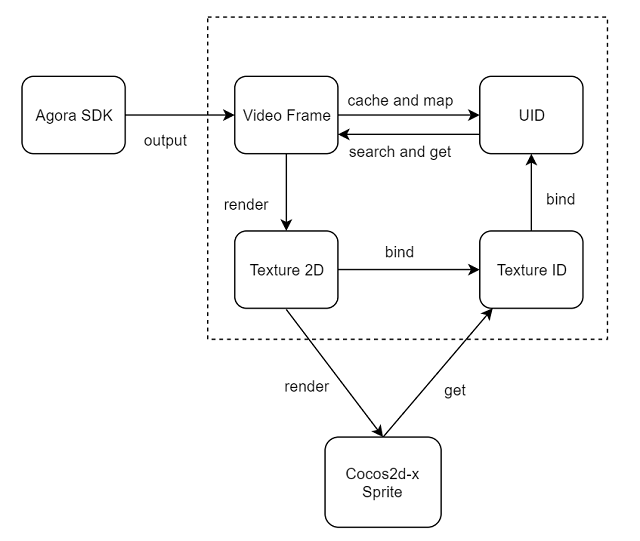

# Implement a [product-name] client

This section shows how to use the [sdk-name] to implement [product-name] into your app step by step.

Open your project file editor and create files in the following structure:

```xml
├─Classes
│ ...
│  │  HelloWorldScene.cpp
│  │  HelloWorldScene.h
│  │  VideoFrameObserver.cpp
│  │  VideoFrameObserver.h
│  │
```

## Import classes and add declaration

In `HelloWorldScene.h`, add the following code import the Agora classes, declare variables, and add function declarations.

```java
// Import the AgoraRtcKit and IAgoraRtcEngine classes.
#ifdef __APPLE__
#include "AgoraRtcKit.h"
#elif __ANDROID__
#include "IAgoraRtcEngine.h"
#endif
// Import the following header files and map container.
#include "VideoFrameObserver.h"
#include "ui/CocosGUI.h"
#include <map>


// Replace <#YOUR APP ID#> with the App ID of your Agora project and add quotation marks, such as "xxxxxx".
#define AGORA_APP_ID <#YOUR APP ID#>
// Replace <#YOUR TOKEN#> with your token and add quotation marks, such as "xxxxxxx".
#define AGORA_TOKEN <#YOUR TOKEN#>


// Add function declarations
class HelloWorld : public cocos2d::Scene {
public:
static cocos2d::Scene *createScene();
bool init() override;
// Occur when a user enters the HelloWorld scene.
void onEnter() override;
// Occur when a user exits the HelloWorld scene.
void onExit() override;
// Define the update() method, which will be called by the scheduleUpdate() method.
void update(float delta) override;
...
public:
// Create and initialize the video view of a specified user.
void addTextureRender(uid_t uid, int width, int height);
// Remove the video view of a specified user.
void removeTextureRender(uid_t uid);
// Remove the video views of all users.
void removeAllTextureRenders();
private:
// Occur when a user clicks the join-channel button.
void onJoinChannelClicked();
// Occur when a user clicks the leave-channel button.
void onLeaveChannelClicked();
private:
cocos2d::ui::EditBox *editBox;
agora::rtc::IRtcEngine *engine;
agora::rtc::IRtcEngineEventHandler *eventHandler;
agora::cocos::VideoFrameObserver *videoFrameObserver;
std::map<uid_t, bool> users;
};
```

## Create the UI

Create the user interface for the [product-name].

We recommend adding the following elements into the UI:

- A channel name edit box
- A join-channel button
- A leave-channel button

In `HelloWorldScene.cpp`, add the following code:

```java
// Create an edit box to get the channel name entered by the user.
// You need to add the TextBox.png image to the ./Resources folder.
auto editBox = cocos2d::ui::EditBox::create(Size(120, 30), "TextBox.png");
if (editBox==nullptr) {
    problemLoading("'TextBox.png'");
} else {  
  editBox->setPlaceHolder("Channel ID");  
  editBox->setPosition(Vec2(origin.x + leftPadding + editBox->getContentSize().width/2,                         
                            origin.y + visibleSize.height                               
                                - editBox->getContentSize().height*1.5f));
    this->addChild(editBox, 0);
}

// Create a join-channel button. Clicking this button triggers the onJoinChannelClicked() function.
// You need to add the Button.png and ButtonPressed.png images to the ./Resources folder.
auto joinButton =
      cocos2d::ui::Button::create("Button.png", "ButtonPressed.png", "ButtonPressed.png");
  if (joinButton==nullptr) {
    problemLoading("'Button.png' and 'ButtonPressed.png'");
  } else {
    joinButton->setTitleText("Join Channel");

    joinButton->setPosition(Vec2(origin.x + leftPadding + joinButton->getContentSize().width/2,
                                 origin.y + visibleSize.height
                                     - 1*joinButton->getContentSize().height
                                     - 2*editBox->getContentSize().height));

    joinButton->addTouchEventListener([&](cocos2d::Ref *sender, ui::Widget::TouchEventType type) {
      switch (type) {
      case ui::Widget::TouchEventType::BEGAN:break;
      case ui::Widget::TouchEventType::ENDED:onJoinChannelClicked();
        break;
      default:break;
      }
    });

    this->addChild(joinButton, 0);
  }

// Create a leave-channel button. Clicking this button triggers the onLeaveChannelClicked() function.
auto leaveButton = ui::Button::create("Button.png", "ButtonPressed.png", "ButtonPressed.png");
  if (leaveButton==nullptr) {
    problemLoading("'Button.png' and 'ButtonPressed.png'");
  } else {
    leaveButton->setTitleText("Leave Channel");

    leaveButton->setPosition(Vec2(origin.x + leftPadding + leaveButton->getContentSize().width/2,
                                  origin.y + visibleSize.height
                                      - 2*leaveButton->getContentSize().height
                                      - 2*editBox->getContentSize().height));

    leaveButton->addTouchEventListener([&](cocos2d::Ref *sender, ui::Widget::TouchEventType type) {
      switch (type) {
      case ui::Widget::TouchEventType::BEGAN:break;
      case ui::Widget::TouchEventType::ENDED:onLeaveChannelClicked();
        break;
      default:break;
      }
    });

    this->addChild(leaveButton, 0);
  }
```

## Implement the [product-name] logic

Take the following steps to initialize `IRtcEngine` and join a [PRODUCT]
 channel.

### Create and initialize the `IRtcEngine` object

In `HelloWorldScene.cpp`, add the following code:

```java
class MyIGamingRtcEngineEventHandler : public agora::rtc::IRtcEngineEventHandler {
private:
  HelloWorld *mUi;

public:
  explicit MyIGamingRtcEngineEventHandler(HelloWorld *ui) : mUi(ui) {}

  // Listen for the onJoinChannelSuccess callback.
  void onJoinChannelSuccess(const char *channel, uid_t uid,
                            int elapsed) override {
  }

  // Listen for the onLeaveChannel callback.
  void onLeaveChannel(const agora::rtc::RtcStats &stats) override {
  }

  // Listen for the onFirstRemoteVideoDecoded callback.
  void onFirstRemoteVideoDecoded(uid_t uid, int width, int height,
                                 int elapsed) override {
  }

  // Listen for the onUserOffline callback.
  void onUserOffline(uid_t uid,
                     agora::rtc::USER_OFFLINE_REASON_TYPE reason) override {
  }
};

...

void HelloWorld::onEnter() {
  cocos2d::Scene::onEnter();
  eventHandler = new MyIGamingRtcEngineEventHandler(this);
  // Create an IRtcEngine object.
  engine = createAgoraRtcEngine();
  // Define RtcEngineContext.
  agora::rtc::RtcEngineContext context;
  context.appId = AGORA_APP_ID;
  context.eventHandler = eventHandler;
  // Initialize the IRtcEngine object.
  engine->initialize(context);
}
```
 
### Join a channel
 
<p props="video">Call the <code>joinChannel</code> method, pass the token, user ID, and channel name to join a video call channel.</p>
<p props="video" conref="conref/get-started-sample-code-cocos2d-x-android.dita#get-started-sample-code/join-call-channel" />
<p props="live">In this step, set the channel profile, client role, and call <code>joinChannel</code> to join an interactive live streaming channel.</p>
<p props="live" conref="conref/get-started-sample-code-cocos2d-x-android.dita#get-started-sample-code/join-live-channel" />
    
### Get and render raw data
 
In the Cocos2d-x project, to display the local and remote video views, you need to use the raw video data function provided by the Agora SDK to get and cache the raw video data, and then send the video data to the Cocos2d-x engine for rendering.


    
1. Get raw video data
       
   In the `VideoFrameObserver.h` file, add the following code:
  
    ```java
    #pragma once
    
    #include <map>
    #include <mutex>
    #include <vector>
    
    #ifdef __APPLE__
    #include <AgoraRtcKit/IAgoraMediaEngine.h>
    #include <AgoraRtcKit/IAgoraRtcEngine.h>
    #elif __ANDROID__
    #include "IAgoraMediaEngine.h"
    #include "IAgoraRtcEngine.h"
    #endif
    
    namespace agora {
    namespace cocos {
    // Define a CacheVideoFrame class, which caches the raw video data.
    class CacheVideoFrame {
    public:
      void resetVideoFrame(media::IVideoFrameObserver::VideoFrame &videoFrame);
    
    public:
      int width;
      int height;
      uint8_t *data;
    };
    
    // Define an IVideoFrameObserver class and register the callbacks of this class.
    class VideoFrameObserver : public media::IVideoFrameObserver {
    public:
      // Set the video format in the return value of the getVideoFormatPreference callback.
      VIDEO_FRAME_TYPE getVideoFormatPreference() override;
      // Set whether to rotate the video frame in the return value of the getRotationApplied callback.
      bool getRotationApplied() override;
      // Get the video data captured by the local camera in the onCaptureVideoFrame callback.
      bool onCaptureVideoFrame(VideoFrame &videoFrame) override;
      // Get the video data sent by the remote user in the onRenderVideoFrame callback.
      bool onRenderVideoFrame(unsigned int uid, VideoFrame &videoFrame) override;
    
    public:
      // Associate the uid with the textureId.
      void bindTextureId(unsigned int textureId, unsigned int uid);
    
    private:
      // Cache the video frame.
      void cacheVideoFrame(unsigned int uid,
                           media::IVideoFrameObserver::VideoFrame &videoFrame);
      // Render the cached video frame into a 2D texture image.                
      void renderTexture(unsigned int textureId, const CacheVideoFrame &frame);
    
    private:
      std::map<unsigned int, CacheVideoFrame> _map;
      std::mutex mtx;
    };
    } // namespace cocos
    } // namespace agora
    ```
   
    In `VideoFrameObserver.cpp`, add the following code to implement the `IVideoFrameObserver` class to get and cache the raw video data output by the Agora SDK.

    ```java
    #include "VideoFrameObserver.h"
    
    #if defined(__ANDROID__)
    #include <GLES/gl.h>
    #include <GLES2/gl2.h>
    #include <GLES2/gl2ext.h>
    #elif defined(__APPLE__)
    #include <OpenGLES/ES2/gl.h>
    #endif
    
    namespace agora {
    namespace cocos {
    void CacheVideoFrame::resetVideoFrame(
        media::IVideoFrameObserver::VideoFrame &videoFrame) {
      auto size = videoFrame.width * videoFrame.height * 4;
      if (size != width * height * 4) {
        if (data) {
          delete[] data;
          data = new uint8_t[size];
        } else {
          data = new uint8_t[size];
        }
      }
      memcpy(data, videoFrame.yBuffer, size);
      width = videoFrame.width;
      height = videoFrame.height;
    }
    
    // Set the video frame type as RGBA.
    media::IVideoFrameObserver::VIDEO_FRAME_TYPE
    VideoFrameObserver::getVideoFormatPreference() {
      return FRAME_TYPE_RGBA;
    }
    
    // Set the SDK to rotate the captured video frame.
    bool VideoFrameObserver::getRotationApplied() { return true; }
    
    // Get and cache the video data captured by the local camera.
    bool VideoFrameObserver::onCaptureVideoFrame(
        media::IVideoFrameObserver::VideoFrame &videoFrame) {
      cacheVideoFrame(0, videoFrame);
      return true;
    }
    
    // Get and cache the video data sent by the remote user.
    bool VideoFrameObserver::onRenderVideoFrame(
        unsigned int uid, media::IVideoFrameObserver::VideoFrame &videoFrame) {
      cacheVideoFrame(uid, videoFrame);
      return true;
    }
    
    // Bind the user ID with the texture ID.
    // If the specified uid is in the map, then the renderTexture() method will be called
    // to render the video frame of the user to a 2D texture image with the specified textureId.
    void VideoFrameObserver::bindTextureId(unsigned int textureId,
                                           unsigned int uid) {
      if (_map.find(uid) != _map.end()) {
        renderTexture(textureId, _map[uid]);
      }
    }
    
    // Cache the video frame output by the Agora SDK, and record the mapping relationship
    // between the video frame and user ID.
    void VideoFrameObserver::cacheVideoFrame(
        unsigned int uid, media::IVideoFrameObserver::VideoFrame &videoFrame) {
      if (_map.find(uid) == _map.end()) {
        _map[uid] = CacheVideoFrame();
      }
      mtx.lock();
      _map[uid].resetVideoFrame(videoFrame);
      mtx.unlock();
    }
    
    // Render the cached video frame into a 2D texture image. 
    void VideoFrameObserver::renderTexture(unsigned int textureId,
                                           const CacheVideoFrame &frame) {
      mtx.lock();
      glBindTexture(GL_TEXTURE_2D, textureId);
      glTexImage2D(GL_TEXTURE_2D, 0, GL_RGBA, frame.width, frame.height, 0, GL_RGBA,
                   GL_UNSIGNED_BYTE, frame.data);
      glBindTexture(GL_TEXTURE_2D, 0);
      mtx.unlock();
    }
    } // namespace cocos
    } // namespace agora
    ```
       
2. Render raw video data
     
   After getting the raw video data, display the local and remote video views.
        
   1. Register the video observer
        
      In `HelloWorldScene.cpp`, add the following code in the `onEnter` function to register the video observer:
        
        ```java
        void HelloWorld::onEnter() {
          ...
        
          // Register a video frame observer object.
          agora::util::AutoPtr<agora::media::IMediaEngine> mediaEngine;
          mediaEngine.queryInterface(engine, agora::AGORA_IID_MEDIA_ENGINE);
          if (mediaEngine) {
            videoFrameObserver = new agora::cocos::VideoFrameObserver;
            mediaEngine->registerVideoFrameObserver(videoFrameObserver);
          }
        }
        ```
           
   2. Create and initialize the video views
         
      Define an `addTextureRender` method to create and initialize the video views of local and remote users. This method creates a 2D texture image according to the specified parameters, uses the 2D texture image to create a sprite object, and then adds the sprite object to the node to display the image in the scene.
     You can use this method to initialize the video views of the local and remote users and add the video views into the `HelloWorld` scene.

        ```java
        void HelloWorld::addTextureRender(uid_t uid, int width, int height) {
          Director::getInstance()->getScheduler()->performFunctionInCocosThread([=] {
            if (users.find(uid) == users.end()) {
              users[uid] = true;
            }
            // Create a 2D texture image.
            auto texture = new cocos2d::Texture2D;
            MipmapInfo info;
            texture->initWithMipmaps(&info, 1, Texture2D::PixelFormat::RGBA4444,
                                     width / 2, height / 2);
            // Use the 2D texture image to create a sprite object.
            auto sprite = Sprite::createWithTexture(texture);
            if (sprite != nullptr) {
              auto visibleSize = Director::getInstance()->getVisibleSize();
              Vec2 origin = Director::getInstance()->getVisibleOrigin();
        
              // Set the position of the sprite object in the scene.
              sprite->setPosition(Vec2(
                  origin.x + visibleSize.width - sprite->getContentSize().width / 2,
                  origin.y + visibleSize.height + sprite->getContentSize().height / 2 -
                      sprite->getContentSize().height * users.size()));
        
              // Add the sprite object as a child node to the scene.
              this->addChild(sprite, 0, "uid:" + std::to_string(uid));
            }
          });
        }
        ```
        
 3. Set the local video view
         
    In `HelloWorldScene. cpp`, add the following code to enable the local view so that the local user can see themselves in the call.

    ```java
    void HelloWorld::onJoinChannelClicked() {
      if (editBox == nullptr || strlen(editBox->getText()) == 0) {
        return;
      }
      // Enable the video.
      engine->enableVideo();
      ...
    }
    
    // In the onJoinChannelSuccess callback, call the addTextureRender() method to set the local video view.
    void onJoinChannelSuccess(const char *channel, uid_t uid,
                                int elapsed) override {
    
        mUi->addTextureRender(0, 640, 480);
      }
    ```

4. Set the remote video view

   In `HelloWorldScene.cpp`, add the following code to set up the remote video view so that the local user can see remote users.
   
   ```java
   void onFirstRemoteVideoDecoded(uid_t uid, int width, int height,
                                 int elapsed) override {
    // Call addTextureRender in the onFirstRemoteVideoDecoded callback
    mUi->addTextureRender(uid, width, height);
   ```

   Call the `update()` method every frame to display each user's video frames as one continuous video.  
   
    ```java
    void HelloWorld::update(float delta) {
      Node::update(delta);
      for (auto user : users) {
        auto sprite =
            this->getChildByName<Sprite *>("uid:" + std::to_string(user.first));
        if (sprite) {
          auto texture = sprite->getSpriteFrame()->getTexture();
    
          int textureId = texture->getName();
          videoFrameObserver->bindTextureId(textureId, user.first);
        }
      }
    }
    ```

## Leave the channel and release `IRtcEngine`

Call the `leaveChannel` method to leave the channel according to your scenario.

```java
void HelloWorld::onLeaveChannelClicked() { engine->leaveChannel(); }

void onLeaveChannel(const agora::rtc::RtcStats &stats) override {
    mUi->removeAllTextureRenders();
  }

void HelloWorld::onExit() {
  Node::onExit();
  agora::rtc::IRtcEngine::release(true);
  engine = nullptr;
  delete eventHandler;
  eventHandler = nullptr;
  delete videoFrameObserver;
  videoFrameObserver = nullptr;
}
```

         

         
    
    
 
 